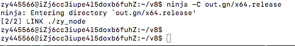

# 利用v8引擎实现运行js文件
这篇文章接着上篇文章《[V8的编译实战](https://github.com/zy445566/myBlog/tree/master/20180708v8/20180708_ninjia_v8)》,相信大家根据上篇文章非常简单的实现了v8的编译，这篇文章主要是讲如何基于 利用v8引擎实现运行js文件 。相信从这篇文章之后，大家能认识到实现一个简单的js运行时，并不是很难。每次都讲helloworld，没什么意义，这次参考 <span>shell</span>.cc，写一个js代码执行器。

# 准备 && 配置
上一篇本人的v8源码的路径是/home/zy445566/v8，所以依旧基于这个目录完成代码的构建 <br />
```sh
# 创建自己的代码目录
mkdir -p /home/zy445566/v8/zy_node_src 
# 创建一个用于写代码的路径
touch /home/zy445566/v8/zy_node_src/zy_node.cc 
```
但我们要如何在ninja是如何关联编译的呢？因为最新版本的v8默认是是基于gn构建的，所以我们只要修改v8源码目录的BUILD.gn来配置编译关联就行了，编辑v8目录的BUILD.gn并再末尾加上以下代码就好，说明请看注释。OK，那么我们来配置gn吧。<br />
```conf
# 这行表示我们要输出的文件名
v8_executable("zy_node") {
  # 这里表示要编译的代码
  sources = [
    # 这个文件就是我们之前touch的文件
    "zy_node_src/zy_node.cc",
    # 由于原生的console输出方式默认不向命令行中输出
    # 所以我们使用d8的console用于命令的输出
    # 这也是我们要编译的文件
    "src/d8-console.cc",
    "src/d8-console.h",
  ]
  # 默认的配置
  configs = [
    ":internal_config_base",
  ]
  # 这里表示我依赖的组件
  deps = [
    ":v8",
    ":v8_libbase",
    ":v8_libplatform",
    "//build/win:default_exe_manifest",
  ]
}
```
OK，配置上基本是完事了，我们开始直接开始写代码了<br />

# 编码
## 引入文件和头
写在前面,源码请直接参考[zy_node.cc](https://github.com/zy445566/myBlog/blob/master/20180708v8/20180714_run_js/zy_node.cc)<br />
首先讲解引用,这是代码的头部，因为我的文件并不是很大，所以头文件并没有拆开<br />
以下主要是引用文件和定义的头文件，详情请看注释 <br />
```c++
#include <include/v8.h>
#include <include/libplatform/libplatform.h>
#include <assert.h>
#include <fcntl.h>
#include <stdio.h>
#include <stdlib.h>
#include <string.h>
//因为引用了d8-console，所以在BUILD.gn配置里面加入了需要编译
#include "src/d8-console.h"

// 这里就是一个创建上下问的方法，我只需要一个上下文，你可以简单理解为定义全局变量
v8::Local<v8::Context> CreateContext(v8::Isolate* isolate);
// 这里就是用于执行命令行的文件的功能
int RunMain(v8::Isolate* isolate, v8::Platform* platform, int argc,
            char* argv[]);
//用于执行js字符串的功能
bool ExecuteString(v8::Isolate* isolate, v8::Local<v8::String> source,
                   v8::Local<v8::Value> name, bool print_result,
                   bool report_exceptions);
//内嵌到js代码里面的功能，你可以理解为fs.readFileSync
void ReadFile(const v8::FunctionCallbackInfo<v8::Value>& args);
v8::MaybeLocal<v8::String> ReadCommandFile(v8::Isolate* isolate, const char* name);
//用于异常的打印
void ReportException(v8::Isolate* isolate, v8::TryCatch* handler);
```
## 入口文件
因为C语言的入口就是main方法，我们可以仔细看一下main方法，并详细解析<br />
### 基本概念（这里我就用简单的白话说说）：
* Isolate:隔离层，你可以理解为nodejs的vm，你创建一个vm就是一个Isolate,里面可以有多个上下文，多个vm可以互相隔离
* Context：上下文，举个例子，一个方法你除了拿方法内的变量数据，你还可以拿方法外的变量数据，而方法外的数据载体就是上下文，简单的理解就是全局变量的载体。
* Handle: 可以理解为js的对象的变量名，但本质是一个对象数据的指针
* HandleScope: 是一个用于装Handle的杯子，而实际是一个盏，如果Handle出了这个最终的HandleScope，意味这个这个数据要从Heap树中移除，等待回收（Scope可以类比到上下文和隔离层）
* 
```c++
int main(int argc, char* argv[]) {
  // 初始化引擎和数据的装载
  v8::V8::InitializeICUDefaultLocation(argv[0]);
  v8::V8::InitializeExternalStartupData(argv[0]);
  // 初始化平台数据
  std::unique_ptr<v8::Platform> platform = v8::platform::NewDefaultPlatform();
  v8::V8::InitializePlatform(platform.get());
  // v8初始化
  v8::V8::Initialize();
  // 创建隔离层的参数，包括使用的内存开辟器
  v8::Isolate::CreateParams create_params;
  create_params.array_buffer_allocator =
      v8::ArrayBuffer::Allocator::NewDefaultAllocator();
  // 创建隔离
  v8::Isolate* isolate = v8::Isolate::New(create_params);
  // 这里使用了D8的console来替换默认的console
  v8::D8Console console(isolate);
  v8::debug::SetConsoleDelegate(isolate, &console);
  int result;
  {
    // 将isolate放入isolate_scope槽中
    v8::Isolate::Scope isolate_scope(isolate);
    v8::HandleScope handle_scope(isolate);
    // 创建一个上下文
    // CreateContext就是将ReadFile绑定到全局变量中的方法
    // CreateContext在稍后会讲到
    v8::Local<v8::Context> context = CreateContext(isolate);
    if (context.IsEmpty()) {
      fprintf(stderr, "Error creating context\n");
      return 1;
    }
    // 将上下文放入scope中
    v8::Context::Scope context_scope(context);
    // 捕获命令行中的文件名的参数，并运行
    result = RunMain(isolate, platform.get(), argc, argv);
  }
  // 各种销毁，就不讲了
  isolate->Dispose();
  v8::V8::Dispose();
  v8::V8::ShutdownPlatform();
  delete create_params.array_buffer_allocator;
  return result;
}
```
## 如何在js中嵌入一个全局的自己写的C++方法
接下来讲解main中的CreateContext方法:<br />
之前也讲解到Context是一个相对全局数据的载体，那么这个方法就是让一些自己写的C++的方法能够绑定到这个载体上，让全局都能使用这个载体，比如nodejs的require就是一个全局对象<br />
我这里增加了一个ReadFile的方法到全局变量中，让自己的运行时的js支持读取本地文件<br />
讲CreateContext前，先讲ReadFile和ReadCommandFile的实现，而CreateContext仅仅是把这个方法绑定到全局而已<br />
```c++
// 是不是很像nodejs的C++扩展的写法
void ReadFile(const v8::FunctionCallbackInfo<v8::Value>& args) {
  // 判断参数是不是只有一个
  if (args.Length() != 1) {
    args.GetIsolate()->ThrowException(
        v8::String::NewFromUtf8(args.GetIsolate(), "Bad parameters",
                                v8::NewStringType::kNormal).ToLocalChecked());
    return;
  }
  // 将文件名转换成v8的字符串
  v8::String::Utf8Value file(args.GetIsolate(), args[0]);
  if (*file == NULL) {
    args.GetIsolate()->ThrowException(
        v8::String::NewFromUtf8(args.GetIsolate(), "Error loading file",
                                v8::NewStringType::kNormal).ToLocalChecked());
    return;
  }
  // 定义文件里面的代码数据的变量
  v8::Local<v8::String> source;
  //调用ReadCommandFile读出文件代码，并检查是否读取成功，ReadCommandFile方法后面会讲到
  if (!ReadCommandFile(args.GetIsolate(), *file).ToLocal(&source)) {
    args.GetIsolate()->ThrowException(
        v8::String::NewFromUtf8(args.GetIsolate(), "Error loading file",
                                v8::NewStringType::kNormal).ToLocalChecked());
    return;
  }
  // 将文件的代码数据返回
  args.GetReturnValue().Set(source);
}
// 这个就是根据文件名读数据，并转换成v8的字符串格式并返回，这个略微带过，稍微有点C基础都很容易看懂
v8::MaybeLocal<v8::String> ReadCommandFile(v8::Isolate* isolate, const char* name) {
  FILE* file = fopen(name, "rb");
  if (file == NULL) return v8::MaybeLocal<v8::String>();

  fseek(file, 0, SEEK_END);
  size_t size = ftell(file);
  rewind(file);

  char* chars = new char[size + 1];
  chars[size] = '\0';
  for (size_t i = 0; i < size;) {
    i += fread(&chars[i], 1, size - i, file);
    if (ferror(file)) {
      fclose(file);
      return v8::MaybeLocal<v8::String>();
    }
  }
  fclose(file);
  // 这个就是把char转换成v8的字符串数据，实际上这是一个Handle
  v8::MaybeLocal<v8::String> result = v8::String::NewFromUtf8(
      isolate, chars, v8::NewStringType::kNormal, static_cast<int>(size));
  delete[] chars;
  return result;
}
//CreateContext这个方法其实就三行
v8::Local<v8::Context> CreateContext(v8::Isolate* isolate) {
  // 新建一个js的Object，Template其实就是C++版本的对象的意思
  v8::Local<v8::ObjectTemplate> global = v8::ObjectTemplate::New(isolate);
  // 将这个对象绑定一个方法，这个方法在js里面叫readfile，绑定的方法就是上面讲的ReadFile
  // FunctionTemplate和上面Template可以类推
  global->Set(
      v8::String::NewFromUtf8(isolate, "readfile", v8::NewStringType::kNormal)
          .ToLocalChecked(),
      v8::FunctionTemplate::New(isolate, ReadFile));
  // 把上下文初始化出来
  return v8::Context::New(isolate, NULL, global);
}
```
## 如何真正通过命令行实现运行js脚本
重头戏来了 <br />
之前讲过入口文件，最后运行RunMain来运行js文件，接下来，就详细讲一下它是如何做到的。 <br />
#### 列一下出现方法
* RunMain (js的具体运行流程)
* ExecuteString （具体执行js代码的功能）
* ReportException（报告js错误的方法，这里不细讲，有兴趣自己研究）
* ReadCommandFile （这个上节讲过的来读取文件，并转换成v8的字符串类型）
```c++
int RunMain(v8::Isolate* isolate, v8::Platform* platform, int argc,
            char* argv[]) {
    // 这里取出了命令行的第二个参数，为什么是第二个？
    // ./zy_node test.js 因为第一个是它本身啊
    const char* str = argv[1];
    // 将字符串转成v8的类型
    v8::Local<v8::String> file_name =
        v8::String::NewFromUtf8(isolate, str, v8::NewStringType::kNormal)
            .ToLocalChecked();
    // 定义js文件内容的变量
    v8::Local<v8::String> source;
    // 用ReadCommandFile读取文件到source，并判断是否读取异常
    if (!ReadCommandFile(isolate, str).ToLocal(&source)) {
        fprintf(stderr, "Error reading '%s'\n", str);
        return 0;
    }
    // 开始执行字符串用js引擎，可以直接往下看到ExecuteString方法
    bool success = ExecuteString(isolate, source, file_name, false, true);
    // 这个就是从事件循环（大名顶顶的EVENT_LOOP）中，执行异步函数
    while (v8::platform::PumpMessageLoop(platform, isolate)) continue;
    // 如果失败返回1
    if (!success) return 1;
    return 0;
}

bool ExecuteString(v8::Isolate* isolate, v8::Local<v8::String> source,
                   v8::Local<v8::Value> name, bool print_result,
                   bool report_exceptions) {
  // 这就是我之前说的“杯子”，不解释第二次了，往上看
  v8::HandleScope handle_scope(isolate);
  // 外面包个try...catch
  v8::TryCatch try_catch(isolate);
  // 将js文件文件名传入，初始化脚本
  v8::ScriptOrigin origin(name);
  // 直接拿当前隔离层的上下文，作为当前的上下文
  v8::Local<v8::Context> context(isolate->GetCurrentContext());
  // 定义脚本变量
  v8::Local<v8::Script> script;
  // 编译文件代码，成功后并传入script变量中，异常则报错
  if (!v8::Script::Compile(context, source, &origin).ToLocal(&script)) {
      // report_exceptions 是传入的值，用于报错的开关
    if (report_exceptions) 
      ReportException(isolate, &try_catch);
    return false;
  } else {
      // 定义执行结果
    v8::Local<v8::Value> result;
    // 运行之前编译成功的script，如果运行失败则报错
    //！！！！注意这行代码就是在运行了
    if (!script->Run(context).ToLocal(&result)) {
      assert(try_catch.HasCaught());
      // Print errors that happened during execution.
      if (report_exceptions)
        ReportException(isolate, &try_catch);
      return false;
    } else {
        //判断确实没有错误，则往下运行
      assert(!try_catch.HasCaught());
        // 是否打印结果，print_result也是一个传入的开关
      if (print_result && !result->IsUndefined()) {
        // If all went well and the result wasn't undefined then print
        // the returned value.
        v8::String::Utf8Value str(isolate, result);
        const char* cstr = ToCString(str);
        printf("%s\n", cstr);
      }
      return true;
    }
  }
}
```
OK！代码讲解完了，就走编译步骤了！

# 编译
因为我们开篇就进行了配置BUILD.gn，所以这次我们直接编译就好<br />
这次编译步骤基本和我上篇文章讲的走<br />
```
cd v8
ninja -C out.gn/x64.release
```
 <br />
不得不说gn的增量编译真的爽，之前编译过的不需要二次编译了。再也不想回到过去的gyp时代了。<br />

# 运行
先写一个js文件在/home/zy445566/v8/out.gn/x64.release/test.js目录下，将以下的代码<br />
```js
// 测试自己写的js运行时，是否正常运行
var a = 1;
var b = 2;
console.log(3);
console.log("test.js:");
// 检查之前写的C++方法ReadFile是否按readfile是否注入
// 是否readfile能正常打印自己
console.log(readfile("test.js"));
```
看看运行结果:<br />
 <br />
完美！！！

# 总结
走完这些步骤，相信只要花足够多的时间堆足够的C++组建就可以模仿出一个简单的node.js。但是我认为直接的基于v8开放不一定是好事，v8本质上就是一个js引擎是一个单独的组件，不应该直接基于v8在上面深度的定制和大量写出和v8底层相关的代码。但由于js引擎没有开发开放标准，导致后面的开发者极度容易直接基于v8直接定制，而不是和引擎接入标准挂钩，这样就容易随着开发定制版时间的推移v8本身的api就越来越难移植到自己的运行时中。v8这点应该学习Rtk，做一个开放和中立的js引擎标准！


