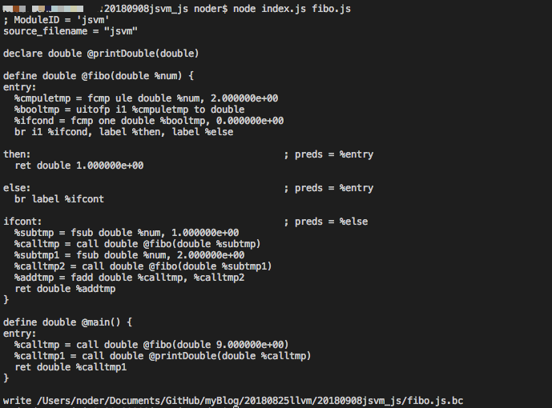

# 使用JS实现JS编译器，并将目标js生成二进制
上一篇文章 [利用LLVM实现JS的编译器，创造属于自己的语言](https://github.com/zy445566/myBlog/tree/master/20180825llvm/20180825jsvm_c) 中讲到使用llvm用C实现JS编译器，本片文章将使用JS来实现JS编译器，还是应了《Atwood定律》能够使用JavaScript实现的，必将使用JavaScript实现。本片文章C代码不超过10行，即使完全不会C也可以相对容易的阅读。
> 本文代码仓库地址:[点这里](https://github.com/zy445566/myBlog/tree/master/20180825llvm/20180908jsvm_js) 

# 本次使用npm库
## @babel/core
直接使用@babel/core来进行词法分析和生成ast。
## llvm-node
使用本库将ast树绑定生成IR(中间代码)和编译成二进制文件，虽然这个库看起来没什么文档，但好用api基本写在了llvm-node.d.ts里面。题外话：讲真我挺喜欢用ts写的库，但我个人不喜欢写ts，当然这并不矛盾。

# 使用@babel/core进行解析
讲真这个挺好用的，解析JS就几行代码就能生成ast,爽歪歪，具体结构不展开，自己可以尝试一下。代码也就几行，应该一看就明白了。
```js
//parse.js
const babel_core = require('@babel/core');
const fs  = require('fs');
module.exports = function (js_path){
    let js_conent = fs.readFileSync(js_path);
    let js_ast = babel_core.parse(js_conent);
    return js_ast;
}
```
# 将解析的的AST绑定IR，实现编译器
## 语法解析开始，针对不通的类型进入不通的入口进行解析
```js
//jsvm.js
class JSVM{
...
    handler(node,parent_node = null) {
        switch(node.type) {
            case 'Program': // 这是主程序入口
                return this.programHandler(node);
            case 'FunctionDeclaration': // 当是方法的类型走这里
                return this.functionHandler(node);
            case 'BlockStatement': // 代码块类型走这里
                return this.blockHandler(node);
            case 'IfStatement': // IF块类型走这里
                return this.ifHandler(node);
            case 'BinaryExpression': // 二进制表达式类型走这里
                return this.binaryHandler(node);
            case 'ReturnStatement': // 解析返回
                return this.returnHandler(node);
            case 'Identifier': // 变量或函数调用，需要通过父节点判断，所以传入
                return this.identifierHandler(node,parent_node);
            case 'NumericLiteral': //数字类型走这
                return this.numberHandler(node);
            case 'StringLiteral': //文本类型走这
                return this.stringHandler(node);
            case 'CallExpression': // 函数调用走着
                return this.callHandler(node);
            case 'ExpressionStatement': // 表达式类型走这
                return this.expressionHandler(node);
            default: // 目前不支持的类型直接抛错
                throw new Error('not support grammar type');
        }
    }
    // 入口文件
    gen() {
        // 初始化变量和方法包括C扩展
        this.init();
        // 将ast进行解析和绑定
        this.handler(this.js_ast.program);
    }
    // 对程序主题不断解析下一个语法节点就好
    programHandler(node) {
        for(let i=0;i<node.body.length;i++)
        {
            this.handler(node.body[i]);
        }
    }
...    
}
```
## 以函数绑定举例
```js
//jsvm.js
    functionHandler(node) {
        // 拿到函数节点的函数名
        let func_name = node.id.name;
        // 判断模块中函数是否存在
        the_function = the_module.getFunction(func_name);
        if (the_function) {
           throw new Error('function is exist');
        }
        // 设置返回值，目前先定死为double类型
        let double_type = llvm.Type.getDoubleTy(the_context);
        // 设置参数，目前先定死为double类型
        let params_list = [];
        for(let i=0;i<node.params.length;i++)
        {
            params_list.push(double_type);
        }
        // 把参数注入，生成函数类型
        let the_function_type = llvm.FunctionType.get(
            double_type,params_list,false
        );
        // 创造出一个函数
        the_function = llvm.Function.create(
            the_function_type,
            llvm.LinkageTypes.ExternalLinkage,
            func_name,the_module
        );
        // 将参数的名称插入
        let the_args = the_function.getArguments();
        for(let i=0;i<the_args.length;i++)
        {
            the_args[i].name=node.params[i].name;
        }
        // 创建函数主运行节点
        let basic_block = llvm.BasicBlock.create(the_context,"entry",the_function);
        // 设置代码插入位置，这个basic_block就是entry节点
        builder.setInsertionPoint(basic_block);
        // 这里是为了注册变量，使得在函数作用域内变量可用
        variable_map = {};
        for(let i=0;i<the_args.length;i++)
        {
            variable_map[the_args[i].name]=the_args[i];
        }
        // 判断函数是否是块表达式，不是则踢出
        if (node.body.type!='BlockStatement')
        {
            throw new Error('function body only support BlockStatement');
        }
        // 调用解析块表达式的方法
        this.blockHandler(node.body);
        // 校验函数是否正确，不正确这个函数会直接报错
        llvm.verifyFunction(the_function);
        return the_function;
    }
```

## 块表达式解析的实现
其实这异步就是遍历节点进行解析，是不是很简单
```js
//jsvm.js
    blockHandler(node)
    {
        let expr_list = [];
        for(let i=0;i<node.body.length;i++)
        {
            expr_list.push(this.handler(node.body[i]));
        }
        return expr_list;
    }
```

## 以IF的解析实现来讲代码块的跳跃
```js
//jsvm.js
    ifHandler(node) {
        //判断条件的类型是否是二进制表达式
        if (node.test.type!='BinaryExpression') {
            throw new Error('if conds only support binary expression');
        }
        // 解析二进制表达式作为条件
        let cond = this.binaryHandler(node.test);
        // 生成数字0
        let zero = llvm.ConstantFP.get(the_context,0);
        // 如果cond不是bool类型的指，将它转换为bool类型的值
        let cond_v = builder.createFCmpONE(cond,zero,"ifcond");
        // 创建then和else和ifcont代码块，实际就是代码块标签
        let then_bb = llvm.BasicBlock.create(the_context,"then",the_function);
        let else_bb = llvm.BasicBlock.create(the_context,"else",the_function);
        let phi_bb = llvm.BasicBlock.create(the_context, "ifcont",the_function);
        // 创造条件判断
        // 如果cond_v是真就跳跃到then_bb代码块，否则跳跃到else_bb代码块
        builder.createCondBr(cond_v,then_bb,else_bb);
        // 设定往then_bb代码块写入内容
        builder.setInsertionPoint(then_bb);
        if (!node.consequent) {throw new Error('then not extist');}
        if (node.consequent.type!='BlockStatement')
        {
            throw new Error('then body only support BlockStatement');
        }
        // 解析代码块
        let then_value_list = this.blockHandler(node.consequent);
        // 如果代码块没内容就就跳跃到phi_bb代码块
        if (then_value_list.length==0)
        {
            builder.createBr(phi_bb);
        }
        // 设定往else_bb代码块写入内容，和then_else差不多
        // 不同点：else允许没有
        builder.setInsertionPoint(else_bb);
        let else_value_list =  [];
        if (node.alternate) {
            if (node.alternate.type!='BlockStatement')
            {
                throw new Error('else body only support BlockStatement');
            }
            else_value_list = this.blockHandler(node.alternate);
        }
        if (else_value_list.length==0)
        {
            builder.createBr(phi_bb);
        }
        // 因为无论是then或else如果不中断一定会往phi_bb代码块
        // 所以后续的代码直接在phi_bb里面写就好
        builder.setInsertionPoint(phi_bb);
    }
```
# 支持C扩展的实现
首先先定义存在值
```js
//jsvm.js
    // 定义一个C函数printDouble用于打印二进制变量
    getPrintDouble()
    {
        // 获取返回值类型
        let double_type = llvm.Type.getDoubleTy(the_context)
        // 设置参数列表
        let params_list = [double_type];
        // 获取函数类型
        let the_function_type = llvm.FunctionType.get(
            double_type,params_list,false
        );
        // 创建函数定义
        the_function = llvm.Function.create(
            the_function_type,
            llvm.LinkageTypes.ExternalLinkage,
            'printDouble',the_module
        );
        // 设置参数名称
        let the_args = the_function.getArguments();
        the_args[0].name = "double_name";
        return the_function;
    }
    // 初始化方法值讲需要预置的方法放入
    init()
    {
        init_function_map.printDouble = this.getPrintDouble();
    }
```
C代码的实现printDouble方法
```cpp
// printDouble.cpp
#include <stdio.h>
// 问什么要要加extern "C" ,因为c++编译的时候会自动进行函数签名
// 如果没有extern "C" ,汇编里的方法名就会是Z11printDoubled
// 其中签名前部分由返回值和命名空间名字中间是方法名，后面是参数缩写
extern "C" {
    // 设定返回值和参数都是double类型
    double printDouble(double double_num) {
        // 打印double类型
        printf("double_num is: %f\r\n",double_num);
        // 返回double类型
        return double_num;
    }
}
```

# 看看实现效果
要被编译的代码
```js
// fibo.js 这是斐波纳切数
function fibo(num) {
    if (num<=2) {return 1;}
    return fibo(num-1)+fibo(num-2);
}
// 讲main作为主函数运行
function main()
{
    return printDouble(fibo(9));
}
```
开始编译,并生成中间代码和bitcode代码，如下
```sh
# index.js是编译器入口，fibo.js是要被编译的函数
node index.js fibo.js
```

将bitcode代码生成汇编代码
```sh
llc fibo.js.bc -o fibo.s
```
将汇编代码和我们要注入的C代码一起编译 <br />
> 当然除了C只要能被gcc编译成汇编的也都支持作为扩展语言,本文举例C代码容易让人理解
```sh
gcc printDouble.cpp fibo.s -o fibo
```
最后运行看看
```sh
./fibo
```


# 总结
这次实现是用纯JS就能实现，如果后续这个JSVM能编译覆盖所有的编译器自身所有的代码功能，理论上来说可以用JSVM编译JSVM实现自举，当然这个是一个浩大的工程，方法是有了缺的只是时间而已。


