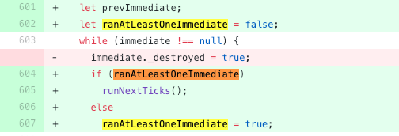

# 又被node的eventloop坑了，这次是node的锅
近日在论坛上看到一篇文章讲node和谷歌浏览器的eventloop的区别，因为看到写的还不错，我表示了肯定。但没过多久一位坛友却说node11结果不一样，我说怎么可能不一样。接着坛友贴了个代码，我试着运行了一下，啪啪打脸！

# 一探究竟
先上被啪啪打脸的代码：
```js
setTimeout(() => {
  console.log('timer1');
  Promise.resolve().then(function() {
    console.log('promise1');
  });
}, 0);
setTimeout(() => {
  console.log('timer2');
  Promise.resolve().then(function() {
    console.log('promise2');
  });
}, 0);
```

了解node的eventloop的同学应该会这样想：
1. 这个就是一开始将两个setTimeout放进timers的阶段。
2. 等到时间到达后运行timer1，把promise1的Promise放入timers的下一阶段微任务队列中，同理继续运行timers的阶段，执行timer2，把promise2的Promise放入timers的下一阶段微任务队列中。
3. 直到timers队列全部执行完，才开始运行微任务队列，也就是promise1和promise2.
那么就是以下结果：
```js
timer1
timer2
promise1
promise2
```
node10运行结果确实是这样，是没问题的。但node11运行后居然是：
```js
timer1
promise1
timer2
promise2
```
挺吃惊的，但吃惊过后还是仔细去翻node的修改日志，在node 11.0 的修改日志里面发现了这个：
* Timers
    * Interval timers will be rescheduled even if previous interval threw an error. #20002
    * nextTick queue will be run after each immediate and timer. #22842

然后分别看了20002和22842的PR，发现在 [#22842](https://github.com/nodejs/node/pull/22842) 在lib/timers.js里面有以下增加：




这两个是什么意思呢？

提示一下runNextTicks()就是process._tickCallback()。用过的可能知道这个就是除了处理一些异步钩子，然后就是执行微任务队列的。于是我增加了两行process._tickCallback()在setTimeout方法尾部，再使用node10运行，效果果然和node11一致，代码如下：
```js
setTimeout(() => {
    console.log('timer1');
    Promise.resolve().then(function() {
        console.log('promise1');
    });
    process._tickCallback(); // 这行是增加的！
}, 0);
setTimeout(() => {
    console.log('timer2');
    Promise.resolve().then(function() {
        console.log('promise2');
    });
    process._tickCallback(); // 这行是增加的！
}, 0);

```

# 那么为什么要这么做呢？
当然是为了和浏览器更加趋同。

了解浏览器的eventloop可能就知道，浏览器的宏任务队列执行了一个，就会执行微任务。

简单的说，可以把浏览器的宏任务和node10的timers比较，就是node10只有全部执行了timers阶段队列的全部任务才执行微任务队列，而浏览器只要执行了一个宏任务就会执行微任务队列。

现在node11在timer阶段的setTimeout,setInterval...和在check阶段的immediate都在node11里面都修改为一旦执行一个阶段里的一个任务就立刻执行微任务队列。


# 最后
所以在生产环境建议还是不要特意的去利用node和浏览器不同的一些特性。即使是node和浏览器相同的特性，但规范没确定的一些特性，也建议小心使用。否则一次小小的node升级可能就会造成一次线上事故，而不只是啪啪打脸这么简单了。