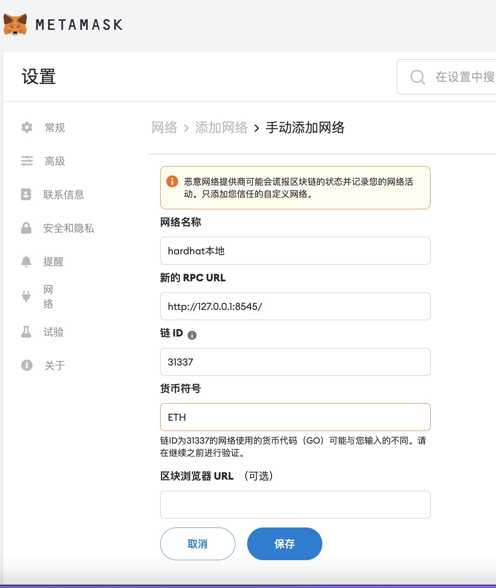
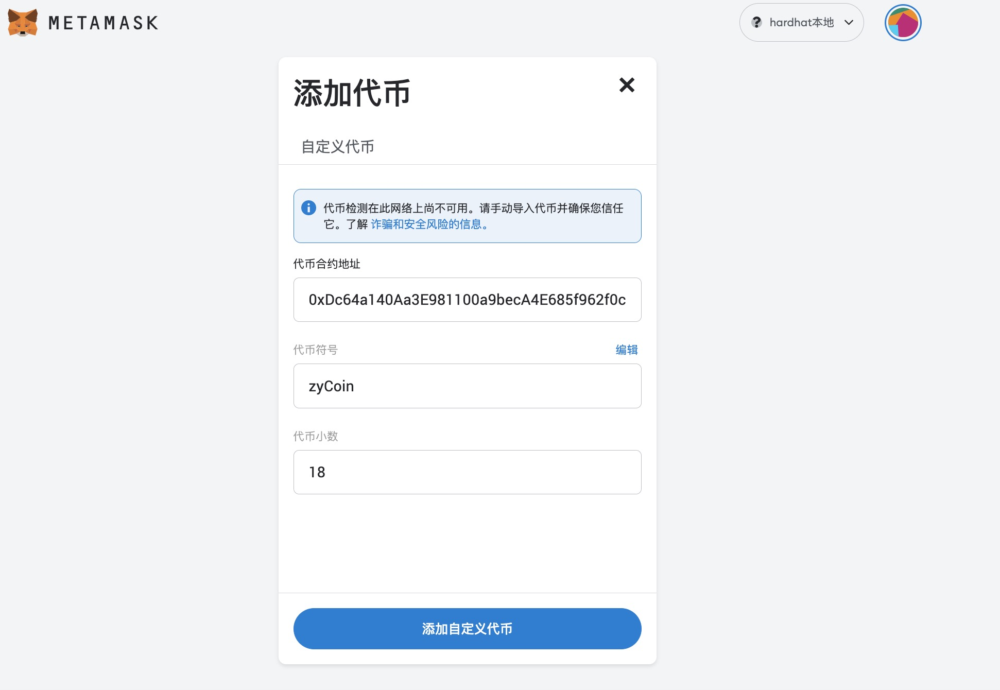
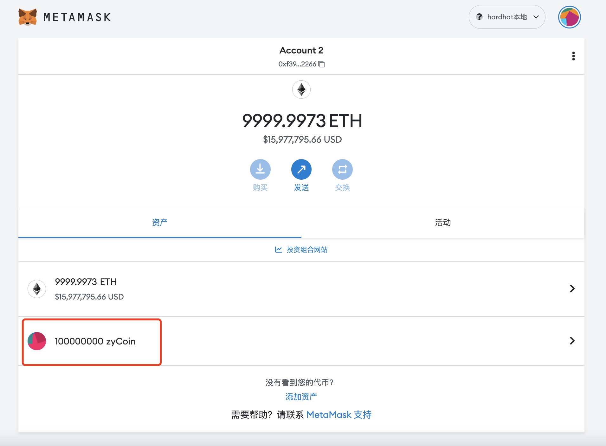
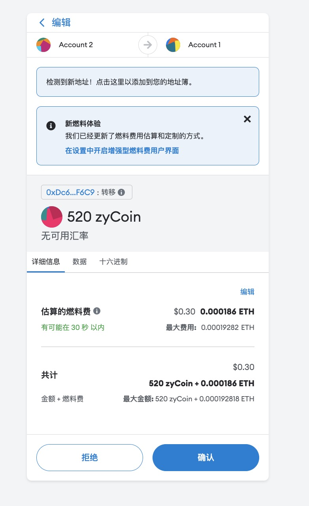

# 在新的一年，我做了一个违背链圈的决定，把发币的教程手把手教给大家
首先我这篇文章真不是标题党，因为区块链的课程都是相对比较贵的，包含如何发币的课程很多是几万人民币打底，加上区块链市场人才的极度缺失，想要利用区块链技术捞钱的老板只能砸重金招募人才，甚至在几年前，你只要会发币到uni或sushi放上去交易，就能轻松赚上上百万刀和上千万人民币。所以免费给小白做的发币教程无疑是背叛了区块链技术圈。

# 0x1 工具准备和安装
该教程仅适用mac电脑或linux系统。如果是win系统，请自行转换相对路径进行。

在工具使用方面，我觉得最好用的应该属于hardhat，为什么呢？因为它涵盖了开发，测试，发行，还带有独自的虚拟eth私有网络，简直可以说是开发上线一条龙服务。这个体验无疑是非常棒，丝滑且顺畅的。

这个工具是使用node.js进行开发的，所以前置条件是我们需要一个node.js，这个对于前端的同学来说简直是利好，毕竟每位前端同学几乎都安装了node.js。但就目前来说JS在区块链方向上的发展可以说处于超越任何语言的高速通道，所以只要你想要进入区块链方向，那JS可以说是必学的一门语言。

node.js的安装，我就不多说了，有需要的直接[[点此]](https://nodejs.org/en/download/)进入官网下载，熟悉的可以自行使用nvm安装从而进行node.js的版本管理。


接下来新建文件夹来初始化项目，并安装hardhat依赖，命令如下：
```sh
# 创建项目文件夹
mkdir myProject 
# 进入项目文件夹
cd myProject
# 初始化node.js工程,此处可以疯狂按回车
npm init
# 安装hardhat依赖，此处稍作等待安装完毕
npm install --save-dev hardhat
# 接下来初始化hardhat项目，这里我比较喜欢创建ts项目提示好些，其他直接回车即可
npx hardhat
```
这几步下来项目就基本初始化好了，我们可以进入下一步合约的开发和编写了

# 0x2 合约的开发和编写
好了项目初始化好了，我们可以看下相应的结构。
```sh
.
├── README.md
├── contracts
│   └── Lock.sol
├── hardhat.config.ts
├── package-lock.json
├── package.json
├── scripts
│   └── deploy.ts
├── test
│   └── Lock.ts
└── tsconfig.json
```
我们可以看到在合约文件夹(`contracts`)有一个自带的合约Lock.sol,这个是hardhat给我们做的一个小demo，我们可以看到Lock.sol的代码其实是使用solidity语言写的合约，这个语言是以太坊推出的DSL，用于运行在以太坊虚拟机中。
```sh
# 那我们可以自己建立一个合约，姑且叫Coin.sol吧
touch ./contracts/Coin.sol
```
OK，那如果我们要发币，我们需要实现ERC20协议，什么是ERC20协议呢？ERC是“EthereumRequest for Comment”缩写，也就是“以太坊征求意见协议”的缩写，而ERC20协议可以说是所有ERC协议中最广为人知的协议，大家使用ETH进行跨币转账，几乎都是使用ERC20，但这个也不是没有缺点，就是费Gas。所以我们也要基于ERC20协议开发我们的代币。

有兴趣可以查看ERC20协议更多介绍[点此查看ERC20协议标准详细介绍](https://eips.ethereum.org/EIPS/eip-20)

这个时候，你要要实现一个协议，会不会很难，感觉工程很庞大，其实你多虑了，ERC20协议只有几个简单的方法需要实现，然后每个方法的作用和目的，我都进行了标注。如下
```ts
interface IERC20 {
    // token名字
    function name() external view returns (string memory);
    // token唯一标识，用于发放代币
    function symbol() external view returns (string memory);
    // token额度最小单位是小数点的后多少位，类似Ether的个和Wei或BTC的个和聪的关系
    function decimals() external view returns (uint8);
    // 交易事件
    event Transfer(address indexed from, address indexed to, uint256 value);
    // 赋予事件
    event Approval(address indexed owner, address indexed spender, uint256 value);
    // token总量查询
    function totalSupply() external view returns (uint256);
    // 某个账户token余额查询
    function balanceOf(address account) external view returns (uint256);
    // 从当前账户转账，结束后需要调用Transfer事件
    function transfer(address to, uint256 amount) external returns (bool);
    // 获取toekn授权量
    function allowance(address owner, address spender) external view returns (uint256);
    // 将自己的token授权给某个账户一定的量，结束后需要调用Approval事件
    function approve(address spender, uint256 amount) external returns (bool);
    // 传入指定从某个账户转账到另一个账户
    function transferFrom(address from, address to, uint256 amount) external returns (bool);
}
```
其实主要的方法就是获取标识和交易以及授权交易(代扣款)的实现，接下来我将对这些方法进行一一实现。

首先我们需要进行一下我们刚刚协议接口的继承，这里的继承不是我们一般语言用的extend关键字而是is,通过继承接口我们就需要对接口的内容做一一实现了，像简单的get方法，我们可以定义好，和一些初始化的设置，可以看我下面这个实现。这些我认为是可以很简单看懂的，大家可以先看一下。
```ts
contract Coin is IERC20 {
    // 这个是用来铸币用的，我要给我自己发币可以使用这个
    address public minter;
    // 币的名称
    string private _name;
    // 币的标识
    string private _symbol;
    // 币的精度
    uint8 private _decimals;
    // 币的总量
    uint256 private _totalSupply;
    // 这个map类型，用于地址映射代币数量
    mapping (address => uint256) private _balances;
    // 这个是map嵌套类型，用于映射某个账户和另一个账户是否存在授权转账，一般用于代转账
    mapping(address => mapping(address => uint256)) private _allowances;

    // 初始化方法
    constructor(string memory nameValue, string memory symbolValue, uint8 decimalsValue) {
        // 把合约创建者变成铸币人
        minter = msg.sender;
        // 确定币的名字
        _name = nameValue;
        // 确定币的标识，有点类似于股票发行代码
        _symbol = symbolValue;
        // 确定最小单位与个的精度
        _decimals = decimalsValue;
        // 初始供应链为0
        _totalSupply = 0;
    }

    function name() public view virtual override returns (string memory) {
        return _name;
    }
    function symbol() public view virtual override returns (string memory) {
        return _symbol;
    }
    function decimals() public view virtual override returns (uint8) {
        return _decimals;
    }

    function totalSupply() public view virtual override returns (uint256) {
        return _totalSupply;
    }
    function balanceOf(address account) public view virtual override returns (uint256) {
        return _balances[account];
    }
    // other code ... 
}
```
* 其中virtual override关键字代表覆盖接口重写
* string为字符串类型，uint8和uint256为不同位的整数类型
* view关键字代表仅查看，因为非查看的操作是要写入区块的，那么会产生费用。

接下来我们重点说一下《铸币方法》和《交易方法》，完整代码可以到[我的博客](https://github.com/zy445566)的该篇文章的文件夹中看到。

其实代码部分远比我们想象的要简单，可能很多人觉得写这个需要算法，其实ETH已经帮我们实现了整个区块链的功能，我以前也完整实现过自己的区块，这里面需要包含大量的算法，比较有趣的比如椭圆加密算法也有比较有意思的思路比如POW。但我们这次不需要，我们只需要在ETH上开发应用就能简单发币。

接下来的几行代码所以，实现币功能的简约性，会超乎你的想象，如下
```ts
contract Coin is IERC20 {
    // 铸币方法，此方法非ERC20协议，纯粹是是自己加的方法，目的是给自己打钱用的
    function mint(address receiver, uint256 amount) public {
        require(msg.sender == minter, "ERC20:You aren't the owner");
        _balances[receiver] += amount;
    }
    // other code ... 
}
```
好比铸币方法你只需要给自己加钱就可以了，加完钱后消耗一定的交易费(Gas)就可以，写入ETH区块。

* 其中_balances是我在类中定义好的变量
* msg主要是包含调用者的一些信息


而交易方法，也是非常简单，只需要让执行transfer方法的人，来进行扣钱，然后让他想要转账的人加钱即可。然后提交一个交易事件，把交易事件给需要监听的人就好了。如下：

```ts
contract Coin is IERC20 {

    // 交易方法
    function transfer(address to, uint256 amount) public virtual override returns (bool) {
        // 校验钱是否足够
        require(amount <= _balances[msg.sender], "ERC20:Insufficient balance.");
        require(amount > 0, "ERC20:Amount has to be greater than 0.");
        _balances[msg.sender] -= amount;
        _balances[to] += amount;
        // 提交交易事件
        emit Transfer(msg.sender, to, amount);
        return true;
    }

    // other code ... 
}
```
可能有人会说真就这么简单么？那可不么，由于ETH屏蔽了底层实现，几行代码就完成了一个交易功能，但区块链的难点永远都不会是功能的实现而是黑客与攻防和底层加密算法，发现一个著名区块链或合约或加密算法的BUG，等价于你找到一个提款机，当然不是本章的重点，否则就太长了，哈哈哈。

OK，合约代码部分写的差不多了，我们可以着手开始发布我们的合约，并开始发币了。[手动狗头]。

# 0x3 部署合约，接入metamask钱包。
首先我们可以使用hardhat启动我们的私域ETH网络，如下命令：
```sh
# 用hardhat启动私域ETH网络
npx hardhat node
```
启动完成后，里面会有打印RPC的URL地址和一些私域ETH网络准备好的ETH的账户地址和私钥。以及记录下RPC的URL地址。

基本完成了，这时候我们打开metamask，这个是一款区块链钱包，由以太坊组织主导开发的，当然其他钱包大多也都支持ERC20协议，比如Trust Wallet等等。了解详情可以进入[metamask官网](https://metamask.io/),安装完成打开即可，我这边就不过多介绍了，币圈都比较熟悉，哈哈哈。

安装metamask完成后，我们设置一下metamask界面添加私域ETH网络。如下图


点击保存完成配置

图片解释:
* 网络名称按自己喜好填写即可
* 新的RPC URL则填入网络打印的RPC的URL地址
* 链 ID则填入hardhat默认的31337。链 ID的作用是啥呢？这个是ETH当初一个多链双花的问题解决的提案
* 货币符号填入ETH即可

然后我们需要在我们的scripts文件夹中，建立一个scripts/deployCoin.ts文件来做部署脚本。主要作用是在里面写部署代码，然后来进行部署。主要就是初始化合约，代码如下：
```ts
import { ethers } from "hardhat";

async function main() {
    // 这里根据我们合约文件夹[contracts]需要部署的合约名称的的名称填入
    const Coin = await ethers.getContractFactory("Coin");
    // 给我的币取名zy445566
    const nameValue = "zy445566";
    // 给我的币的标识zyCoin
    const symbolValue = "zyCoin";
    // 设置币的精度
    const decimalsValue = 18;
    
    // 初始化部署
    const coin = await Coin.deploy(nameValue, symbolValue, decimalsValue);

    // 等待部署完成
    await coin.deployed();

    // 获取铸币人
    const minter = await coin.minter();

    // 给自己打1个亿自己的代币，因为小数点是18，所以要乘以10的18次方
    // 数字后面带n主要是JS的bigint语法
    await coin.mint(minter, 1n*10n**8n*10n**18n)

   // 打印一下关键信息
    console.log(`Coin deployed!nameValue:${nameValue},deployed to ${coin.address},minter is ${minter}`);
}

main().catch((error) => {
    console.error(error);
    process.exitCode = 1;
});
```


我们新开一个命令行窗口，直接用hardhat执行脚本的部署即可，运行以下命令。
```sh
# 用hardhat执行对应的脚步部署文件，部署到我们的私域ETH网络，如果发布到主网需要配置主网信息
npx hardhat run scripts/deployCoin.ts --network localhost
```
执行完命令后，你应该会输出Coin deployed!后面跟着关键信息nameValue，symbolValue，deployedAdress和minterAdress，这些后续都要使用，在后续跟大家说。

然后我们在私域ETH网络准备好的ETH的账户中找到minterAdress的私钥，并导入到metamask中，接下来在metamask点击添加资产按钮。
* 代币合约地址为部署时输出的deployedAdress地址
* 代币符号为输出的symbolValue
* 代币小数为decimalsValue
如下图：


添加完成，则看到你的私域ETH网络出现了你的代币和数量
如下图：

接下来你可以尝试给自己的另一个账号转账和用自己的代币交易了，如图。


注意接收到代币的一方也是要注意添加资产的哦！

# 结语
至此购买一定的ETH作为发行到主网代币的费用就可以发行你的代币并上链交易了，同时编写好你的故事，上coinlist或swap平台就可以等别人花钱给你买酒了。祝您早日暴富，哈哈哈


