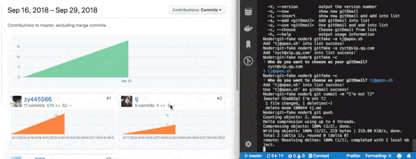

# 让大佬向你仓库PR关键技术，拿去装逼，不要谢我
前段时间看到可以通过修改git的邮箱实现，实现伪造记录，但是修改起来还挺麻烦的，大佬的账号不能在命令行中保存，遂做了一个命令行工具，专门用来伪造github的提交请求。😎

# 先看效果
> 伪造了当年TJ大佬的提交记录


# 是不是很想要TJ大神的力量
来吧，全局安装完，直接敲命令就能实现
```sh
# 全局安装 git-fake
npm install git-fake -g
# 看看是否安装成功
gitfake -V
# 在项目根目录使用TJ的邮箱(只对该项目生效)
# 如果要伪造别人的账号，直接在github看邮箱即可
gitfake -u tj@apex.sh
# 对于使用过的账号，直接就能选择
gitfake -c
```
剩下的工作就是在这个项目提交代码了，提交完成后可以使用"git log"命令查看提交记录的邮箱是否被修改，如下 <br />


# 缺点
不过假的终究是假的，努力提升自己水平才是王道啊