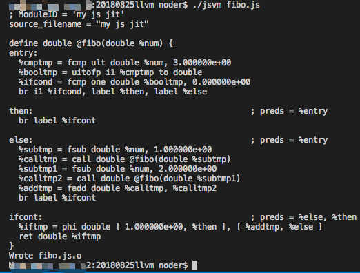

# 利用LLVM实现JS的编译器，创造属于自己的语言
本文参考了官方教程Kaleidoscope语言的实现，本文只实现了JS的编译器的demo，如果想要加深学习比如语言的JIT的实现和语言的代码优化，我将官方教程和代码集合打包在了 [github.com/zy445566/llvm-guide-zh](https://github.com/zy445566/llvm-guide-zh) 中有兴趣，可以更加深入的学习。

# 什么是LLVM
像大家熟知的Swift就是依靠LLVM实现的一门语言，还有Rust也是将LLVM用于后端编译。<br />
一句话总结，它就是一种编译器的基础设施。可能有人说是gcc一类的东西么？老实说最初它却是用来取代gcc的，但它拥有的绝不是编译而是拥有制造新语言能力的全部能力的一个工具。可以让人更加无痛的实现一门语言。<br />
本文编译器流程大概是【编写AST用于分析语言结构】->【将分析的语言绑定生成IR(中间语言)】-> 【生成二进制或汇编代码】 <br />
如果使用LLVM制作语言的虚拟机亦可以实现JIT，或者是编译器和虚拟机的结合体。

# 准备工作
## 安装LLVM
```sh
# centOS，ubuntu应该也可以使用yum或apt-get进行安装
# 有时间的话下载源码编译当然更好
brew install llvm
```
## mac还需要安装xcode命令行工具
```sh
# 两台电脑都装了xcode,一台编译居然找不到标准库
# 这个问题我找了好久
xcode-select --install
```

# 编写AST用于分析语言结构阶段
先定义token类型，用于识别词法结构，定义负数的原因是ascii码的字符都是正数
```h
enum Token{
    tok_eof = -1,
    // define
    tok_var = -2,
    tok_func = -3,
    // code type
    tok_id = -4,
    tok_exp = -5,
    tok_num = -6,
    // choose
    tok_if = -7,
    tok_else = -8,
    // interrupt
    tok_return = -9,
    // other
    tok_unkown = -9999
};
```
解析token的方法，也可以用于字符跳跃
```cpp
static int gettoken()
{
    LastChar = fgetc(fp);
    // 排除不可见字符
    while (isspace(LastChar))
    {
        LastChar = fgetc(fp);
    }
    // 排除注释
    if (LastChar=='/' && (LastChar = fgetc(fp))=='/'){
        do{
            LastChar = fgetc(fp);
        } 
        while (!feof(fp) && LastChar != '\n' && LastChar != '\r' && LastChar != 10);
        // 吃掉不可见字符
        while (isspace(LastChar))
        {
            LastChar = fgetc(fp);
            if (LastChar=='/') {fseek(fp,-1L,SEEK_CUR);}
        }
    }
    // 解析[a-zA-Z][a-zA-Z0-9]*
    if (isalpha(LastChar)) {
        defineStr = LastChar;
        int TmpChar;
        while (isalnum((TmpChar = fgetc(fp))) && (LastChar = TmpChar))
        {
            defineStr += TmpChar;
        }
        fseek(fp,-1L,SEEK_CUR);
        if (defineStr == "var")
        {
            return tok_var;
        }
        if (defineStr == "function")
        {
            return tok_func;
        }
        if (defineStr == "if")
        {
            return tok_if;
        }
        if (defineStr == "else")
        {
            return tok_else;
        }
        if (defineStr == "return")
        {
            return tok_return;
        }
        return tok_id;
    }
    // 解析[0-9.]+
    if (isdigit(LastChar) || LastChar == '.') {
        std::string NumStr;
        do {
        NumStr += LastChar;
        LastChar = fgetc(fp);
        } while (isdigit(LastChar) || LastChar == '.');
        NumVal = strtod(NumStr.c_str(), nullptr);
        return tok_num;
    }
    if(feof(fp)){
        return tok_eof;
    }
    return LastChar;
}
```
再次定义语法结构数的语法，这个可以根据自己的喜好定义
```h
// AST基类
class ExprAST {
public:
  virtual ~ExprAST() = default;
  // 这是用于实现IR代码生成的东西
  virtual llvm::Value *codegen() = 0;
};

// 定义解析的数字的语法树
class NumberExprAST : public ExprAST {
  double Val;

public:
  NumberExprAST(double Val) : Val(Val) {}
  llvm::Value *codegen() override;
};

// 定义解析的变量的语法树
class VariableExprAST : public ExprAST {
  std::string Name;

public:
  VariableExprAST(const std::string &Name) : Name(Name) {}
  llvm::Value *codegen() override;
};
// 还有很多语法类型，由于太多，暂时不写
...
```
循环获取token并进入对应的方法
```cpp
static void LoopParse() {
    while (true) {
        LastChar = gettoken();
        switch (LastChar) {
        case tok_eof:
            return;
        case ';':
            gettoken();
            break;
        case tok_func:
            HandleFunction();
            break;
        case tok_if:
            HandleIf();
            break;
        default:
            break;
        }
    }
}
```
解析JS方法的功能
```cpp
static std::unique_ptr<FunctionAST> HandleFunction() {
    LastChar = gettoken();
    // 解析方法的参数
    auto Proto = ParsePrototype();
    if (!Proto){return nullptr;}
    // 吃掉方法的大括号
    gettoken();
    if (LastChar != '{'){return LogErrorF("Expected '{' in prototype");}
    // 定义方法的内容，这是一个数组，因为方法是多行的
    std::vector<FnucBody> FnBody;
    while(true){
        // 这是这一行代码的类型，其中包含表达式和是否返回数据
        FnucBody fnRow;
        if (auto E = ParseExpression())
        {
            fnRow.expr_row = std::move(E);
            fnRow.tok = RowToken;
            RowToken = 0;
            FnBody.push_back(std::move(fnRow));
        } else {
            // 如果这一行是分号，让下一次gettoken去吃掉分号
            if (LastChar == ';'){continue;}
            // 如果方法结束判断是否有大括号，没有则报异常
            if (LastChar != '}'){return LogErrorF("Expected '}' in prototype");}
            // 生成方法的AST
            auto FnAST = llvm::make_unique<FunctionAST>(std::move(Proto), std::move(FnBody));
            // 生成方法的代码
            if (auto *FnIR = FnAST->codegen()) {
                //异常则输出错误, 未出异常则输出IR
                // FnIR->print(llvm::errs());
            }
            return FnAST;
        }
    }
    return nullptr;
}
```
而里面比较复杂应该是ParseExpression，用于解析表达式的方法,复杂点在于表达式中可能还有表达式，表达式里面还有表达式，有的时候思考下来，脑子里面基本是无限递归，能让脑子瞬间短路
```cpp
// 表达式解析
static std::unique_ptr<ExprAST> ParseExpression() {
    // 解析表达式的左边
    auto LHS = ParsePrimary();
    if (!LHS){
        return nullptr;
    }
    // 解析表达式的操作符和表达式的右边
    return ParseBinOpRHS(0, std::move(LHS));
}
// 判断表达式左边是什么类型
static int RowToken = 0;
static std::unique_ptr<ExprAST> ParsePrimary() {
  int res = gettoken();
  switch (res) {
  default:
    return LogError("unknown token when expecting an expression");
  case tok_id:
    // 如果是变量或执行的方法
    return ParseIdentifierExpr();
  case tok_if:
    // 如果是if
    return HandleIf();
  case tok_num:
    // 如果是数字
    return ParseNumberExpr();
  case tok_return:
    // 如果是返回则标记，并继续执行表达式左边
    RowToken = tok_return;
    return ParsePrimary();
  case '}':
    // 符号跳过
    return nullptr;
  case ';':
    // 符号跳过
    return nullptr;
  case '(':
    // 作为父表达式运行
    return ParseParenExpr();
  }
}
// 解析表达式的操作符和表达式的右边
static std::unique_ptr<ExprAST> ParseBinOpRHS(
    int ExprPrec,
    std::unique_ptr<ExprAST> LHS
) {
  gettoken();
  while (true) {
    // 判断操作符优先级
    int TokPrec = GetTokPrecedence();
    // 如果操作符优先级低，直接返回当前
    if (TokPrec < ExprPrec){return LHS;}
    // 如果操作符优先级高，继续运算
    int BinOp = LastChar;
    // 分析右表达式
    auto RHS = ParsePrimary();
    if (!RHS){return nullptr;}
    // 继续表表达式
    int NextPrec = GetTokPrecedence();
    // 继续分析操作符优先级
    if (TokPrec < NextPrec) {
      RHS = ParseBinOpRHS(TokPrec + 1, std::move(RHS));
      if (!RHS){return nullptr;}
    }
    // 将左右表达式合并
    LHS = llvm::make_unique<BinaryExprAST>(BinOp, std::move(LHS),
                                           std::move(RHS));
  }
}

```
# 将分析的语言绑定生成IR(中间语言)
看完上面的是不是觉得有点慌，其实解析好了，生成IR很简单。IR是一个中间语言，简单就是把一门语言转换成另一门语言，而解析好了的话，其实就只剩下绑定了。<br />
先看看方法的AST的定义
```h
// 方法中的一行的类型定义
struct FnucBody{
    // 是否有token
    int tok;
    // 这一行的表达式
    std::unique_ptr<ExprAST> expr_row;
};
class FunctionAST {
  // 参数列表定义
  std::unique_ptr<PrototypeAST> Proto;
  // 方法中全部表达式行
  std::vector<FnucBody> FnBody;

public:
  // 构造
  FunctionAST(std::unique_ptr<PrototypeAST> Proto,
              std::vector<FnucBody> FnBody)
      : Proto(std::move(Proto)), FnBody(std::move(FnBody)) {}
  //  定义IRcode的生成方法
  llvm::Function *codegen();
};
```
具体生成IR的方法
```h
llvm::Function *FunctionAST::codegen() {
  // 获取函数名，并检测是否是已存在的函数
  llvm::Function *TheFunction = TheModule->getFunction(Proto->getName());
  
  // 如果函数不存在，则生成行数及参数并将函数重新赋值
  if (!TheFunction)
    TheFunction = Proto->codegen();
  
  // 如果没生成成功，说明参数存在问题
  if (!TheFunction)
    return nullptr;

  // 在上下文中将entry语法块插入方法中
  llvm::BasicBlock *BB = llvm::BasicBlock::Create(TheContext, "entry", TheFunction);
  Builder.SetInsertPoint(BB);

  // 将参数写入map中
  NamedValues.clear();
  for (auto &Arg : TheFunction->args())
    NamedValues[Arg.getName()] = &Arg;

  // 遍历每一行并生成代码，如果token是return，则设置返回数据
  for (unsigned i = 0, e = FnBody.size(); i != e; ++i) {
    llvm::Value *RetVal = FnBody[i].expr_row->codegen();
    if (FnBody[i].tok==tok_return){
      Builder.CreateRet(RetVal);
    }
    // 如果全部的行执行完成则校验方法并返回方法
    if(i+1==e){
      verifyFunction(*TheFunction);
      return TheFunction;
    }
    
  }
  // 发生错误移除方法
  TheFunction->eraseFromParent();
  return nullptr;
}
```

# 生成二进制文件
```h
int destFile (std::string FileOrgin) {
  // 初始化发出目标代码的所有目标
  llvm::InitializeAllTargetInfos();
  llvm::InitializeAllTargets();
  llvm::InitializeAllTargetMCs();
  llvm::InitializeAllAsmParsers();
  llvm::InitializeAllAsmPrinters();
  // 使用我们的目标三元组来获得Target
  auto TargetTriple = llvm::sys::getDefaultTargetTriple();
  TheModule->setTargetTriple(TargetTriple);

  std::string Error;
  auto Target = llvm::TargetRegistry::lookupTarget(TargetTriple, Error);

  if (!Target) {
    llvm::errs() << Error;
    return 1;
  }

  auto CPU = "generic";
  auto Features = "";

  llvm::TargetOptions opt;
  auto RM = llvm::Optional<llvm::Reloc::Model>();
  // 将编译的机器信息录入
  auto TheTargetMachine =
      Target->createTargetMachine(TargetTriple, CPU, Features, opt, RM);
  // 通过了解目标和数据布局，优化代码
  TheModule->setDataLayout(TheTargetMachine->createDataLayout());
  
  // 定义文件流
  std::string  Filename = FileOrgin+".o";
  std::error_code EC;
  llvm::raw_fd_ostream dest(Filename, EC, llvm::sys::fs::F_None);

  if (EC) {
    llvm::errs() << "Could not open file: " << EC.message();
    return 1;
  }
  
  // 代码写入流中
  llvm::legacy::PassManager pass;
  auto FileType = llvm::TargetMachine::CGFT_ObjectFile;

  if (TheTargetMachine->addPassesToEmitFile(pass, dest, FileType)) {
    llvm::errs() << "TheTargetMachine can't emit a file of this type";
    return 1;
  }
  // 完成并清除流
  pass.run(*TheModule);
  dest.flush();
  // 输出完成提示
  llvm::outs() << "Wrote " << Filename << "\n";
  return 0;
}
```
# 编译编译器
将我们做好的编译器编译出来，生成jsvm文件
```sh
clang++ -g -O3 jsvm.cpp  `llvm-config --cxxflags --ldflags --system-libs --libs all` -o jsvm
```

# 使用我们写好的编译器编译js文件
## 编译js
js文件如下
```js
// fibo.js 这是斐波纳切数
function fibo(num) {
    if (num<3) {
        return 1;
    } else {
        return fibo(num-1)+fibo(num-2);
    }
}
```
开始编译js文件，将生成 fibo.js.o,如下
```sh
./jsvm fibo.js
```


## 使用c引用js文件，并编译成二进制文件
c代码如下：
```cpp
// main.cpp
#include <iostream>

extern "C" {
    double fibo(double);
}

int main() {
    std::cout << "fibo(9) is: " << fibo(9) << std::endl;
}
```
编译并运行,如下：
```sh
clang++ main.cpp fibo.js.o -o main && ./main
```


# 总结
第一次写编译器感觉很凌乱，编译器本身来说还算是一个相对复杂的工程，加上js语言的灵活多变性，实现起来可能更加困难，不过这作为一个学习的例子应该是不错的，遂与大家分享。<br />
相信llvm将来也是能为JS助力的，事实上已经有人有很大胆的想法去使用llvm编译JS，前段时间facebook的prepack就有这样一个PR[【facebook/prepack/pull/2264】](https://github.com/facebook/prepack/pull/2264)去实现用llvm将js编译成二进制而无需运行时。兄弟们！JS自举的路或许不会太远了。