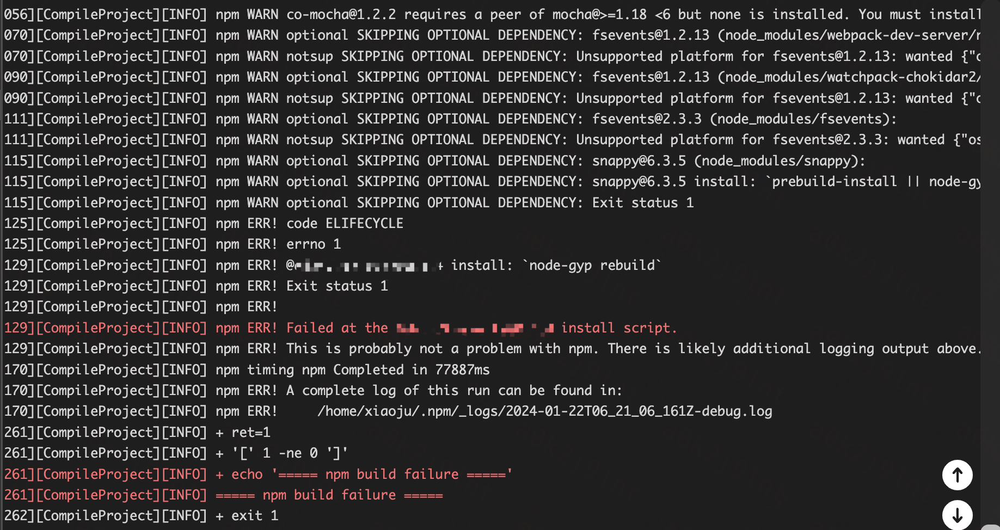
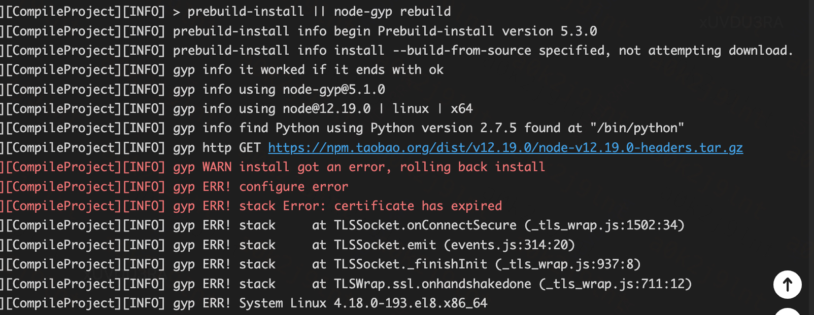
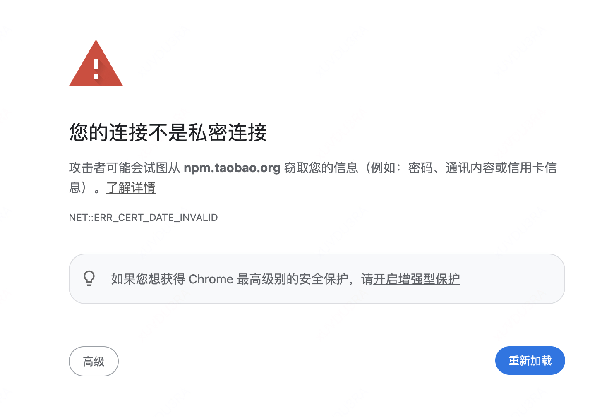
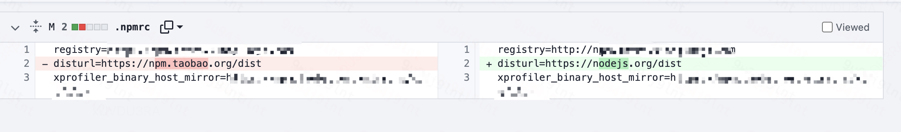

# 前端和Node端的同学注意了，在1月22日之后可能就无法编译C++扩展了
这听起来很很吓人，但实际也是如此，虽然2024年1月22日已经过去，但是这个风险依然没有过去相信很多人也遇到了类似的问题，简单来说就是国内某宝npm镜像证书过期了，虽然我们公司有自己的私有npm镜像，但是也对于一些非npm镜像的地方也难免会中招。

# 事件起因
是这样的，我们有一个Node.js项目因为历史原因一直没有做前端后端分离，然后前端的同学在构建项目的过程中发现一直构建失败，原因是我们后端一个C++扩展一直编译失败，这个时候因为项目进度比较着急，然后又基本确定是后端的C++扩展没有成功编译的原因，所以老板就指派我进行一个排查和修复。当时看到大概是这样的一个现象。

因为这个C++扩展也没人改过，昨天还好好的，今天怎么就坏了，所以一看这个问题就知道```看起来不简单实则一点也不知道如何下手```


# 根因定位
还好机智如我往上翻了翻编译过程，发现有另一个报错，就是node的头文件下载报错了。



再科普一下这个node的头文件是用来干嘛的，在Node.js的n-api出现之前，Node.js的C++构建都是依赖于node-gyp，而node-gyp的用途就是抹平Node.js的不同版本的构建问题，而为什么不同版本会有构建问题，原因有两个一个是底层的V8的版本升级导致对外的接口变动导致node的对外的C++接口也需要跟着变动，另外一个原因就是node自身的C++接口的升级。所以node-gyp需要下载每个node版本的编译的头文件来获取当前版本对外的C++接口信息，从而实现C++扩展和Node.js底层的交互。所以我们在编译扩展的时候需要这个node的头文件来抹平不通node版本的C++接口的差异。

一看这个下载报错证书过期，一看又是淘宝。我就想起前几天刚刚看到说淘宝镜像证书要过期，赶紧打开。



好家伙，看来找到根因了。

# 解决问题
找到根因那就简单了。直接使用命令看一把
```sh
# 这个命令可以查看npm下载文件的地址
npm config get disturl
# 输出：https://npm.taobao.org/dist
```
一看果然是淘宝镜像，这就好办了，因为现在npm.taobao.org域名迁移到了npmmirror.com，所以我们按照新的域名改一下构建脚本，加入下面的命令。
```sh
# 这个命令可以设置npm下载文件的地址
npm config set disturl https://npmmirror.com/dist
```
居然还是构建失败，原因还是一样，好家伙这么玩是吧，再看一下项目，有一个.npmrc的文件，在这个文件下果然有disturl配置，看来.npmrc优先级高于环境变量，那改一把。

修改完后，果然构建顺利

# 结束
顺利结束，我的工位后方终于没有了熙熙攘攘的人群，这个世界安静了

