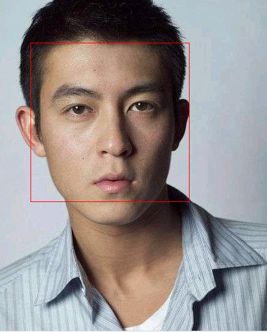
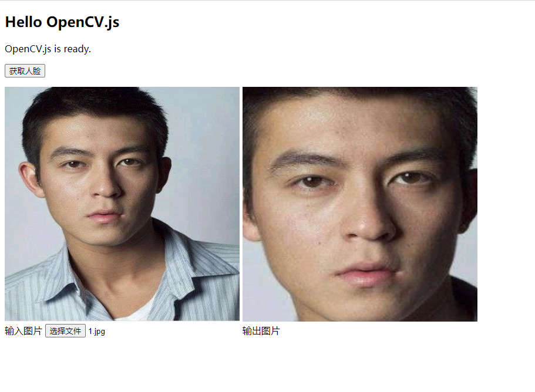

# 使用WebAssembly版本opencv实现人脸识别
最近公司的需求又开始作妖了，说要做用户人脸识别，要知道照片有几个脸，和脸部位置。这需求下来让我这个CURD-BOY有点慌了，果然这个重任又落到了我身上。所以开始研究扣脸技术，之前使用过opencv做过盲水印技术，所以这次就打算继续选取opencv来做这个。

但由于很久没有接触opencv了，之前还是基于2.4做的，现在都4.3了，果然还是逝者如斯夫不舍昼夜。既然如此，重新看官方文档来一遍。

# 发现新大陆
这个时候居然发现了`opencv.js`,不看不知道一看高兴坏了。原来`opencv.js`是opencv利用了[emscripten](https://github.com/emscripten-core/emscripten)将原本的C++版本编译成了WebAssembly，让js可以直接调用C++版本的opencv方法。

这下省事了，线上部署也方便了。要知道在之前如果要用，线上服务器还要装opencv的开发套还要编写C++扩展，这样非常容易出问题，如果是docker，添加安装脚本前期工作量能让你爆炸。如果是主机，则很容易因为线上linux版本问题和环境问题，导致调用opencv出错。但现在有`WebAssembly`版本的`opencv.js`一切都变的不一样了。

所以今天我打算通过opencv.js来实现扣脸技术。

# 获取opencv.js
获取opencv.js有两种途径
1. 使用源码构建([教程地址](https://docs.opencv.org/master/d4/da1/tutorial_js_setup.html))
2. 直接下载构建好的版本([下载地址](https://docs.opencv.org/master/opencv.js))

两者都可以直接使用在nodejs或js上，区别是源码构建先需要先有emscripten环境，步骤比较麻烦。下载则版本固定且方便，但如果你要修改opencv源码实现特殊功能，那就不行了。

# 首先实现nodejs服务端版本
其实在官网例子Face Detection using Haar Cascades([例子地址](https://docs.opencv.org/master/d2/d99/tutorial_js_face_detection.html))就有这个例子，但区别是服务端读取图片方式不同，在例子中使用的是前端的canvas读取，后端读取图片主要是使用了jimp库来读取图片。

同时其实在人脸识别中，opencv有一个自带的训练模型haarcascade_frontalface_default.xml，这个模型可以在opencv的代码库中找到([代码库地址](https://github.com/opencv/opencv/tree/master/data/haarcascades))。

既然方法有了，模型也有了，是不是可以直接开撸u，很方便就能实现？
```js
Module = {
    async onRuntimeInitialized() {
      console.log(cv.getBuildInformation())
      await getFace()
    }
  }
const cv = require('./opencv.js');
const fs = require('fs');
const Jimp = require('jimp');
const path = require('path');

async function getFace() {
    var jimpSrc = await Jimp.read(path.join(__dirname,'gx.jpg'));
    let src = cv.matFromImageData(jimpSrc.bitmap);
    let gray = new cv.Mat();
    cv.cvtColor(src, gray, cv.COLOR_RGBA2GRAY, 0);
    let faces = new cv.RectVector();
    let faceCascade = new cv.CascadeClassifier();
    // load pre-trained classifiers
    cv.FS_createDataFile(
        '/', 'haarcascade_frontalface_default.xml', 
        fs.readFileSync(path.join(__dirname,'haarcascade_frontalface_default.xml')), 
        true, false, false
    );
    faceCascade.load('haarcascade_frontalface_default.xml');
    // // detect faces
    let msize = new cv.Size(0, 0);
    faceCascade.detectMultiScale(gray, faces, 1.1, 3, 0, msize, msize);
    for (let i = 0; i < faces.size(); ++i) {
        let roiGray = gray.roi(faces.get(i));
        let roiSrc = src.roi(faces.get(i));
        let point1 = new cv.Point(faces.get(i).x, faces.get(i).y);
        let point2 = new cv.Point(faces.get(i).x + faces.get(i).width,
                                faces.get(i).y + faces.get(i).height);
        cv.rectangle(src, point1, point2, [255, 0, 0, 255]);
        roiGray.delete(); roiSrc.delete();
    }
    new Jimp({
        width: src.cols,
        height: src.rows,
        data: Buffer.from(src.data)
    }).write('gxOutput.png');
    src.delete(); gray.delete(); faceCascade.delete();
    faces.delete();
}
```
nodejs实现也就花了45行代码，其中为什么Module要在require('./opencv.js')之前是因为在'./opencv.js'文件中执行了全局的Module.onRuntimeInitialized方法。

那么实现效果如下：
* 输入照片：
    * 
* 识别照片：
    * 

# js前端实现
先讲一下为什么要在前端实现，是由于计算量不大不会影响用户体验，同时可以节约上传图片和下载图片的消耗，更重要的是实现也非常方便。

js前端实现的话，基本和nodejs差不多，区别在于读取图像使用canvas和使用ajax请求获取模型文件。

```html
<!DOCTYPE html>
<html>
<head>
<meta charset="utf-8">
<title>Hello OpenCV.js</title>
</head>
<body>
<h2>Hello OpenCV.js</h2>
<p id="status">OpenCV.js is loading...</p>
<p><button id="getFaceBtn">获取人脸</button></p>
<div>
  <div class="inputoutput">
    <div>
        <canvas id="canvasInput" width="400" height="400"></canvas>
    </div>
    <div class="caption">输入图片 <input type="file" id="fileInput" name="file" /></div>
  </div>
  <div class="inputoutput">
    <div>
        <canvas id="canvasOutput" width="400" height="400"></canvas>
    </div>
    <div class="caption">输出图片</div>
  </div>
</div>
<script type="text/javascript">
let inputElement = document.getElementById('fileInput');
let faceBtn = document.getElementById('getFaceBtn');
let img = new Image();
inputElement.addEventListener('change', (e) => {
    img.src = URL.createObjectURL(e.target.files[0]);
}, false);
img.onload = function() {
    let inCanvas = document.getElementById('canvasInput')
    let inCanvasCtx = inCanvas.getContext('2d')
    inCanvasCtx.drawImage(img,0,0,img.width,img.height,0,0,400,400);
    if(img.width!==400 ||  img.height!=400) {
        inCanvas.toBlob(function(blob) {
            img.src = URL.createObjectURL(blob);
        })
    }
};
faceBtn.addEventListener('click', (e) => {
    let outCanvas = document.getElementById('canvasOutput')
    let outCanvasCtx = outCanvas.getContext('2d');
    let src = cv.imread('canvasInput');
    let gray = new cv.Mat();
    cv.cvtColor(src, gray, cv.COLOR_RGBA2GRAY, 0);
    let faces = new cv.RectVector();
    let faceCascade = new cv.CascadeClassifier();
    // load pre-trained classifiers
    faceCascade.load('haarcascade_frontalface_default.xml');
    // // detect faces
    let msize = new cv.Size(0, 0);
    faceCascade.detectMultiScale(gray, faces, 1.1, 3, 0, msize, msize);
    for (let i = 0; i < faces.size(); ++i) {
        let roiGray = gray.roi(faces.get(i));
        let roiSrc = src.roi(faces.get(i));
        const offest = 0
        let point1 = new cv.Point(faces.get(i).x, faces.get(i));
        let point2 = new cv.Point(faces.get(i).x + faces.get(i).width,
                                faces.get(i).y + faces.get(i).height);
        outCanvasCtx.drawImage(img, 
        faces.get(i).x,
        faces.get(i).y,
        faces.get(i).width,
        faces.get(i).height,
        0,0,400,400)
        roiGray.delete(); roiSrc.delete();
    }
    src.delete(); gray.delete(); faceCascade.delete();
    faces.delete();
})
function onOpenUtilsReady() {
    let utils = new Utils('errorMessage');
    utils.loadOpenCv(() => {
    document.getElementById('status').innerHTML = 'OpenCV.js is ready.';
    let faceCascadeFile = 'haarcascade_frontalface_default.xml';
    utils.createFileFromUrl(faceCascadeFile, faceCascadeFile, () => {
        console.log('加载模型成功')
    });
});
}

</script>
<script async src="./utils.js" onload="onOpenUtilsReady();" type="text/javascript"></script>
<style>
.inputoutput{
    display: inline-block;
}
</style>
</body>
</html>
```

效果如下：



[实例地址展示地址，需翻墙](https://zy445566.github.io/opencv/)


# 最后的选型
虽然nodejs服务端和JS前端都实现了扣脸功能，若直接使用前端实现扣脸，可以实现扣脸保证用户体验，又节约图片上传和下载的带宽，为用户和公司节约了资源，充分利用边缘计算优势。

但若前端实现，考虑到opencv.js的wasm文件过大，需要做进度条加载文件比较麻烦，前端进度很可能来不及，且对于前端复杂度度提升有风险超过前端所能承受的范围，所以最终还是使用nodejs服务端的加载opencv.js实现。

同时能实现前端和后端的服务，也不禁感叹一声WebAssembly牛逼！emscripten牛逼！opencv.js牛逼！Node.js牛逼！JS牛逼！